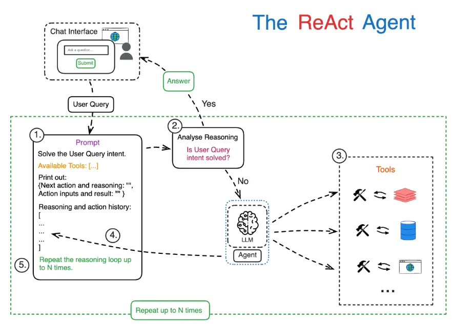

# Teoría del curso — LLMs y RAG

Documento de referencia con toda la teoría detrás de los notebooks y scripts del
repositorio: qué hace cada técnica, por qué se usa, y qué librería la implementa.
El README explica **cómo correr** cada ejemplo; este documento explica **qué hay
detrás** de cada uno.

## Índice

1. [Fundamentos de LLMs (Clase 1)](#1-fundamentos-de-llms-clase-1)
2. [Inferencia: local vs. remota](#2-inferencia-local-vs-remota)
3. [RAG (Retrieval-Augmented Generation)](#3-rag-retrieval-augmented-generation)
4. [Variantes de RAG implementadas](#4-variantes-de-rag-implementadas)
5. [Agentes y orquestación de agentes](#5-agentes-y-orquestación-de-agentes)
6. [Glosario de librerías](#6-glosario-de-librerías)

---

## 1. Fundamentos de LLMs (Clase 1)

Todo lo de esta sección vive en `clase1_llm_practica.ipynb` y es la base
conceptual sobre la que se apoya el resto del curso (RAG, agentes, etc.).

### 1.1 Tokenización

Un modelo de lenguaje no procesa texto: procesa **números**. La tokenización es
el paso que convierte texto en una secuencia de enteros (IDs), cada uno
correspondiente a una entrada de un **vocabulario** fijo aprendido durante el
entrenamiento del tokenizer.

**Por qué no se tokeniza por palabra completa:** un vocabulario de "todas las
palabras posibles" sería enorme y no podría manejar palabras nuevas (nombres
propios, jerga, errores de tipeo). La solución que usan los LLMs modernos es
tokenizar en **subpalabras**: fragmentos que pueden ser una palabra completa, un
prefijo/sufijo, o hasta una sola letra si hace falta.

Algoritmos de subword tokenization comparados en el notebook:

- **BPE (Byte-Pair Encoding)** — usado por GPT-2. Arranca con caracteres
  individuales y va **fusionando** iterativamente el par de símbolos más
  frecuente del corpus de entrenamiento, hasta llegar al tamaño de vocabulario
  deseado. Resultado: las palabras frecuentes quedan como un solo token: las
  raras se fragmentan en varios.
- **WordPiece** — usado por BERT. Muy similar a BPE, pero en vez de fusionar el
  par *más frecuente*, fusiona el par que **maximiza la probabilidad del
  corpus** bajo un modelo de lenguaje simple. En la práctica da resultados
  parecidos a BPE.
- **Tokenizer multilingüe** (BERT multilingual) — entrenado sobre texto de
  decenas de idiomas a la vez. Suele fragmentar **menos** el español que un
  tokenizer entrenado solo en inglés, porque vio suficiente texto en español
  durante su propio entrenamiento como para haber aprendido subpalabras
  específicas del idioma.

**Métrica clave: fragmentación (tokens por palabra).** Si una palabra se parte
en muchos tokens, el modelo necesita más "pasos" para representarla y generarla,
lo que impacta directamente en **costo** (las APIs cobran por token) y
**latencia** (más tokens = más tiempo de inferencia). El notebook mide esto
tokenizando el mismo texto en español e inglés con los 3 tokenizers y
graficando el ratio tokens/palabra.

*Librería: [`tokenizers`](https://github.com/huggingface/tokenizers) /
[`transformers`](https://github.com/huggingface/transformers) (Hugging Face) —
`AutoTokenizer.from_pretrained(...)` carga el tokenizer real de cada modelo.*

### 1.2 Embeddings clásicos (Word2Vec, GloVe)

Un **embedding** es un vector de números reales (ej: 100 dimensiones) que
representa el *significado* de una palabra (o token, oración, documento). La
idea central, formulada por la hipótesis distribucional ("una palabra se
conoce por la compañía que mantiene"), es que palabras que aparecen en
contextos parecidos deberían tener vectores parecidos.

- **Word2Vec** — entrena estos vectores desde cero sobre un corpus, con dos
  variantes: *skip-gram* (predice las palabras de contexto a partir de la
  palabra central — mejor para corpus chicos) y *CBOW* (predice la palabra
  central a partir del contexto). El notebook entrena un Word2Vec de juguete
  (skip-gram, `vector_size=50`) sobre un puñado de oraciones, para mostrar el
  **mecanismo** de entrenamiento — con tan poco texto los resultados no son muy
  confiables.
- **GloVe** (Global Vectors) — a diferencia de Word2Vec (que mira ventanas
  locales de contexto), GloVe se entrena sobre **estadísticas globales de
  co-ocurrencia** de todo el corpus. El notebook usa vectores GloVe
  **pre-entrenados** (100 dimensiones, entrenados sobre Wikipedia + Gigaword)
  vía `gensim.downloader`, para tener embeddings de calidad real sin entrenar
  nada.

**Similitud coseno:** para comparar dos vectores se usa el coseno del ángulo
entre ellos (`cos θ = (a·b) / (|a||b|)`), que da un valor entre -1 y 1 (en la
práctica, para embeddings de texto, casi siempre entre 0 y 1). Cuanto más
cercano a 1, más "parecidos" en significado. Es la métrica que usa
`most_similar()` para encontrar las palabras más cercanas a una dada.

**Analogías vectoriales:** el ejemplo clásico `king - man + woman ≈ queen`
muestra que las *relaciones semánticas* (como "género") quedan codificadas como
**direcciones consistentes** en el espacio de embeddings — no solo el
significado de una palabra aislada, sino la relación entre pares de palabras.
El notebook lo verifica numéricamente (`most_similar(positive=[...],
negative=[...])`) y lo visualiza geométricamente: proyecta las 4 palabras a 2D
con PCA y dibuja flechas `man→woman` y `king→queen` para ver si son paralelas.

*Librería: [`gensim`](https://radimrehurek.com/gensim/) — `Word2Vec` para
entrenar, `gensim.downloader` para bajar vectores pre-entrenados.*

### 1.3 Visualización de embeddings (t-SNE, UMAP, PCA)

Los embeddings de GloVe tienen 100 dimensiones — imposibles de graficar
directamente. Se necesita **reducir la dimensionalidad** a 2D preservando, en
la medida de lo posible, la estructura del espacio original (que palabras
parecidas queden cerca en el gráfico).

- **PCA (Principal Component Analysis)** — método lineal clásico: encuentra
  las direcciones de máxima varianza en los datos y proyecta sobre las 2
  principales. Es determinista, rápido, y preserva bien las distancias
  relativas globales — por eso se usa para la visualización de la analogía
  vectorial (donde importa que las flechas se vean realmente paralelas).
- **t-SNE (t-distributed Stochastic Neighbor Embedding)** — método no lineal
  que prioriza preservar la **vecindad local**: puntos cercanos en 100D siguen
  cercanos en 2D, pero las distancias *globales* (entre clusters lejanos) no
  son confiables. Tiene un hiperparámetro clave, `perplexity`, que controla
  cuántos vecinos considera relevantes por punto (afecta mucho el resultado
  visual — el notebook invita a probar `perplexity=5` vs `15`).
- **UMAP (Uniform Manifold Approximation and Projection)** — alternativa más
  moderna a t-SNE: suele preservar mejor **tanto** la estructura local como la
  global, y es más rápido en datasets grandes. Se controla con `n_neighbors` y
  `min_dist`.

**Nota importante para la clase:** t-SNE y UMAP son estocásticos y sensibles a
hiperparámetros — correrlos dos veces con distinta semilla puede dar layouts
visualmente distintos (aunque preserven la misma estructura de vecindad). Por
eso el notebook fija `random_state=RANDOM_SEED` para reproducibilidad, y el
ejercicio invita a notar qué tan sensible es el resultado.

*Librerías: [`scikit-learn`](https://scikit-learn.org/) (`TSNE`, `PCA`),
[`umap-learn`](https://umap-learn.readthedocs.io/) (`UMAP`) — esta última es
opcional (el notebook sigue funcionando solo con t-SNE si no está instalada).*

### 1.4 Attention y Multi-Head Attention

El mecanismo de **atención** es el corazón de la arquitectura Transformer (la
base de prácticamente todos los LLMs modernos). Permite que, al procesar una
posición de la secuencia, el modelo "mire" (preste atención a) todas las demás
posiciones y decida cuánto pesa cada una para construir su representación.

**Scaled dot-product attention** — la fórmula central:

```
Attention(Q, K, V) = softmax( Q·Kᵀ / √d_k ) · V
```

- **Q (queries), K (keys), V (values)** — tres proyecciones lineales distintas
  del mismo input. Intuición: cada posición emite una *query* ("qué estoy
  buscando"), y compara esa query contra la *key* de cada otra posición ("qué
  ofrezco") para decidir cuánta atención prestarle; el resultado pondera los
  *values* correspondientes.
- **Q·Kᵀ** — producto punto entre queries y keys: mide cuánto "coincide" cada
  query con cada key (scores de similitud).
- **/ √d_k** — el escalado evita que, con vectores de dimensión grande, los
  productos punto crezcan tanto que el softmax posterior se sature (quedando
  casi todo el peso en un solo elemento, con gradientes casi nulos para
  entrenar).
- **softmax** — convierte los scores en pesos que suman 1 por fila: literalmente
  "qué porcentaje de atención" recibe cada posición.
- **máscara (opcional)** — poniendo `-inf` antes del softmax en ciertas
  posiciones, se las anula (quedan en 0 tras el softmax). Es la base de la
  **atención causal**: una máscara triangular que le impide a una posición
  "ver" las posiciones futuras — necesaria en modelos generadores (GPT-2) que
  predicen la siguiente palabra sin hacer trampa mirando el futuro.

**Multi-Head Attention** — en vez de una sola atención "grande", se parte
`Q`, `K`, `V` en `num_heads` cabezas más chicas (cada una de dimensión
`d_k = d_model / num_heads`), se calcula atención en paralelo en cada cabeza,
y se vuelven a juntar. Intuición: cada cabeza puede especializarse en un tipo
distinto de relación (una en concordancia sujeto-verbo, otra en referencias
pronominales, etc.) — una sola cabeza grande tendría que promediar todo eso en
un mismo espacio.

El notebook implementa **ambas cosas desde cero en PyTorch puro** (sin usar
`nn.MultiheadAttention`), para que el mecanismo quede completamente expuesto
antes de verlo funcionar "de caja negra" en un modelo real.

*Librería: [`torch`](https://pytorch.org/) (PyTorch) — tensores, `nn.Module`,
`nn.Linear`, `F.softmax`.*

### 1.5 Arquitecturas: Encoder vs. Decoder

Una vez implementada la atención a mano, el notebook la observa **funcionando
de verdad** dentro de dos modelos pre-entrenados con arquitecturas opuestas:

- **DistilBERT (encoder-only)** — atención **bidireccional**: cada token puede
  atender a *cualquier* otro token de la oración, incluidos los que vienen
  después. Tiene sentido porque BERT no genera texto secuencialmente; se
  entrena para tareas de comprensión (clasificación, extracción) donde ver la
  oración completa de una vez ayuda.
- **GPT-2 (decoder-only)** — atención **causal**: cada token solo puede atender
  a sí mismo y a los tokens *anteriores* (máscara triangular). Tiene que ser
  así porque GPT-2 se entrena para predecir la siguiente palabra — si pudiera
  ver el futuro durante el entrenamiento, la tarea sería trivial y no
  aprendería nada útil para generar texto en producción (donde el futuro
  todavía no existe).

El notebook extrae los pesos de atención reales (`output_attentions=True`) de
una capa/cabeza específica para la misma oración ambigua
(*"The animal didn't cross the street because it was too tired"* — ¿a qué se
refiere *it*?) en ambos modelos, y los visualiza como heatmaps lado a lado
(con [`bertviz`](https://github.com/jessevig/bertviz) si está disponible, o un
heatmap manual con `matplotlib` si no). La comparación deja ver visualmente la
forma triangular de la atención causal de GPT-2 (nunca hay peso por encima de
la diagonal) contra el patrón libre de DistilBERT.

*Librería: [`transformers`](https://github.com/huggingface/transformers) —
`AutoModel` (DistilBERT), `AutoModelForCausalLM` (GPT-2).*

---

## 2. Inferencia: local vs. remota

Dos formas distintas de "usar" un LLM, con trade-offs opuestos:

### 2.1 Ollama (local)

[Ollama](https://ollama.com) empaqueta modelos open-weight (Gemma, Llama,
modelos de embeddings, etc.) para correrlos **en tu propia máquina**, vía un
servidor HTTP local (`http://127.0.0.1:11434`). Ventajas: sin costo por uso,
sin necesidad de internet una vez descargado el modelo, sin límites de rate
ni preocupaciones de privacidad de los datos que le mandás. Desventaja: la
calidad/tamaño del modelo está limitado por el hardware disponible (CPU/GPU
local), y la primera descarga de cada modelo pesa varios GB.

Modelos usados en el curso:
- **`gemma3`** — modelo de chat/generación (el "cerebro" que redacta las
  respuestas en todos los ejemplos de RAG).
- **`nomic-embed-text`** — modelo dedicado a generar embeddings (no genera
  texto, solo vectores) — el que se usa para indexar y buscar en las bases
  vectoriales.

*Librería: [`ollama`](https://github.com/ollama/ollama-python) (cliente
Python oficial) — `ollama.chat(...)`, `ollama.embeddings(...)`.*

### 2.2 Hugging Face Inference API (remota)

`prueba_modelo_hf_remoto.ipynb` muestra el enfoque opuesto: en vez de
descargar el modelo, se manda la petición a servidores de Hugging Face
(`InferenceClient`) y se recibe la respuesta — el mismo patrón que usar la API
de OpenAI o Anthropic. Ventaja: cero descarga, no depende del hardware local.
Desventaja: necesita conexión a internet en **cada** llamada, un token de
cuenta gratuita, y está sujeto a los modelos que el proveedor decida seguir
sirviendo (la Inference API gratuita — `provider="hf-inference"` — dejó de
servir modelos de generación de texto libre como `gpt2`; el notebook usa en
cambio **question answering extractivo** y **fill-mask**, que sí siguen
disponibles gratis).

*Librería: [`huggingface_hub`](https://github.com/huggingface/huggingface_hub)
— `InferenceClient`.*

---

## 3. RAG (Retrieval-Augmented Generation)

### 3.1 Qué es y por qué

Un LLM solo "sabe" lo que vio durante su entrenamiento — no tiene acceso a
información privada, ni a datos posteriores a su fecha de corte, y puede
**alucinar** (inventar con total confianza) cuando no sabe algo. RAG ataca
ese problema combinando dos pasos:

1. **Retrieval (recuperación)** — dada una pregunta, buscar en una base de
   conocimiento propia los fragmentos de texto más relevantes.
2. **Generation (generación)** — pasarle esos fragmentos al LLM como
   **contexto** dentro del prompt, y pedirle que responda basándose *solo* en
   eso.

El resultado: el modelo puede responder sobre información que nunca vio
durante su entrenamiento (documentos privados, noticias recientes, la wiki de
un equipo), y —si el prompt lo pide explícitamente— puede admitir cuándo el
contexto no alcanza en vez de inventar.

### 3.2 Pipeline general

Todas las variantes de este repo comparten, en esencia, el mismo pipeline:

```
Documentos → chunking → embeddings → índice vectorial
                                            │
Pregunta → embedding → búsqueda por similitud (top-k) → contexto
                                            │
                          contexto + pregunta → prompt → LLM → respuesta
```

- **Chunking**: los documentos se parten en fragmentos manejables (ver
  [4.6](#46-rag-sobre-pdfs-chunking-por-caracteres-vs-por-oraciones) para el
  detalle de dos estrategias distintas).
- **Embeddings**: cada chunk se convierte en un vector numérico que
  representa su significado (mismo concepto que en [1.2](#12-embeddings-clásicos-word2vec-glove),
  aplicado a fragmentos de texto en vez de palabras sueltas).
- **Índice vectorial**: una estructura de datos optimizada para encontrar,
  dado un vector de consulta, los `k` vectores más parecidos sin tener que
  compararlo contra *todos* uno por uno (ver [3.3](#33-bases-de-datos-vectoriales-y-similitud)).

### 3.3 Bases de datos vectoriales y similitud

Una base de datos vectorial almacena embeddings y responde eficientemente a
consultas del tipo "dame los k vectores más similares a este". La métrica de
similitud más común (y la que usan todos los ejemplos de este repo) es la
**distancia/similitud coseno**, la misma explicada en
[1.2](#12-embeddings-clásicos-word2vec-glove).

Este repo usa dos bases vectoriales distintas, para mostrar el contraste:

- **[ChromaDB](https://www.trychroma.com/)** — embebida: corre en el mismo
  proceso Python, persiste en una carpeta local (`PersistentClient(path=...)`),
  sin servidor aparte. Ideal para prototipos y para correr en clase sin
  infraestructura.
- **[Pinecone](https://www.pinecone.io/)** — administrada en la nube: se crea
  un índice remoto (`Pinecone(api_key=...)`), se hace `upsert` de vectores con
  metadata, y se consulta sin manejar servidores propios. Pensada para
  producción y volúmenes grandes.

---

## 4. Variantes de RAG implementadas

### 4.1 RAG simple (Ollama + ChromaDB)

`RAG/rag_simple.py` — la implementación más directa del pipeline de la
[Sección 3.2](#32-pipeline-general), **sin ningún framework**: solo
`ollama.embeddings()`, `ollama.chat()` y la API de ChromaDB. Sirve como
referencia mínima de qué hace "por debajo" cualquier framework de RAG más
sofisticado, antes de agregarle capas de abstracción.

*Librerías: `ollama`, [`chromadb`](https://docs.trychroma.com/).*

### 4.2 RAG con LangChain

[LangChain](https://python.langchain.com/) es un framework para construir
aplicaciones con LLMs, con componentes reutilizables (prompts, retrievers,
memoria, agentes, herramientas) y un lenguaje de composición llamado **LCEL**
(LangChain Expression Language): se encadenan componentes con el operador `|`,
de forma parecida a un pipe de shell (`{"context": retriever | format_docs,
"question": ...} | prompt | llm | StrOutputParser()`).

`RAG/langchain/` tiene 5 ejemplos incrementales, cada uno agregando una
capacidad sobre el anterior:

- **`1_rag_basico.py`** — el pipeline de la Sección 3.2 armado con LCEL en
  vez de código manual. El "hola mundo" de RAG con LangChain.
- **`2_rag_memoria.py`** — le agrega **memoria conversacional**. Dos ideas:
  - *History-aware retriever*: antes de buscar en la base vectorial,
    reformula la pregunta del usuario usando el historial de la charla — así
    "¿y eso para qué sirve?" se puede resolver aunque, sin contexto, esa
    pregunta sola no se pudiera buscar bien.
  - *Memoria acotada por ventana*: el historial se recorta a los últimos N
    mensajes (`trim_messages`) en vez de crecer indefinidamente.
- **`3_rag_tools.py`** — reemplaza la cadena fija por un **agente ReAct**
  (Reasoning + Acting): el LLM, en un bucle, decide en cada paso qué
  **herramienta** usar (`buscar_docs` = RAG, `calculadora`, `fecha_hoy`),
  observa el resultado, y repite hasta poder responder. El patrón ReAct se
  implementa con un prompt específico (Thought/Action/Observation) para que
  funcione incluso con modelos sin "tool calling" nativo, como Gemma vía
  Ollama.
- **`4_rag_skills.py`** — patrón alternativo a los tools: cada capacidad es una
  **"skill" definida en su propio archivo markdown** (carpeta `skills/`, con un
  header que declara nombre y descripción) y un **router** (el LLM clasificando
  la intención) despacha a UNA skill. Lo distintivo es la **carga a demanda**:
  el router lee solo los headers para decidir, y el cuerpo de la skill se carga
  recién cuando se la elige. Más declarativo y predecible que un agente que
  decide libremente en un bucle — a costa de ser menos flexible ante tareas que
  combinan varias skills. Detalle del patrón en
  [5.4](#54-skills-como-archivos-markdown-agent-skills).
- **`5_rag_langsmith.py`** — igual al RAG básico, pero con **observabilidad**:
  si están seteadas las variables de entorno de
  [LangSmith](https://smith.langchain.com), cada ejecución queda registrada
  con el árbol completo de pasos (retriever → prompt → LLM), latencias,
  tokens y entradas/salidas de cada componente — clave para depurar y evaluar
  aplicaciones LLM en producción, más allá de mirar solo el resultado final.

*Librerías: [`langchain-core`](https://pypi.org/project/langchain-core/)
(prompts, runnables, LCEL), `langchain` (agentes, chains de alto nivel),
[`langchain-ollama`](https://pypi.org/project/langchain-ollama/) (`ChatOllama`,
`OllamaEmbeddings`), [`langchain-chroma`](https://pypi.org/project/langchain-chroma/),
[`langsmith`](https://docs.smith.langchain.com/) (tracing).*

### 4.3 RAG con Pinecone

`RAG/pinecone/rag_pinecone.py` — idéntico en estructura a `rag_simple.py`,
pero reemplaza ChromaDB por **Pinecone** como base vectorial (embeddings y
generación siguen siendo locales vía Ollama — solo el *almacenamiento e
indexado* de vectores se mueve a la nube). Muestra el patrón real de "RAG en
producción": indexado con `upsert`, creación de índice `serverless` con
detección automática de dimensión, y manejo de credenciales vía `.env`
(nunca hardcodeadas).

*Librería: [`pinecone`](https://docs.pinecone.io/reference/python-sdk) (SDK
oficial).*

### 4.4 Graph RAG

`RAG/graph/rag_grafos.py` — en vez de recuperar *chunks* de texto sueltos de
una base vectorial, la base de conocimiento es un **grafo**: nodos =
conceptos, aristas = relaciones (tripletas `sujeto → relación → objeto`, ej.
`("RAG", "usa", "base de datos vectorial")`).

Flujo de recuperación:
1. **Detectar entidades**: se comparan (por embedding + similitud coseno) los
   nombres de los nodos del grafo contra la pregunta, para encontrar qué
   conceptos son relevantes.
2. **Recuperar vecindario**: desde esos nodos, se hace BFS
   (`single_source_shortest_path_length`) hasta una profundidad de N saltos,
   para traer las relaciones "cercanas" en el grafo.
3. **Serializar como contexto**: ese subgrafo se convierte a texto plano
   (`sujeto --relación--> objeto`) y se le pasa al LLM.

**Ventaja sobre RAG vectorial clásico**: el contexto son hechos explícitos y
*conectados* entre sí, no fragmentos de texto sueltos — útil para preguntas
que requieren combinar varios hechos relacionados (ej. "¿qué diferencia hay
entre X e Y?"), donde un chunk de texto aislado sobre X y otro sobre Y por
separado no arman la comparación tan bien como una relación explícita.

En este ejemplo el grafo vive **en memoria** (armado a partir de una lista fija
de tripletas en el propio script) — no hay persistencia en disco ni un
servidor de base de grafos externo (a diferencia de, por ejemplo, Neo4j, que
sería la opción típica para un grafo de conocimiento grande y persistente).

*Librería: [`networkx`](https://networkx.org/) (`MultiDiGraph` — grafo
dirigido que admite múltiples relaciones entre el mismo par de nodos).*

### 4.5 Wiki-LLM

`RAG/wiki_llm/rag_wiki.py` — implementa el patrón descrito por Andrej Karpathy
para bases de conocimiento personales: en vez de una base vectorial con
embeddings por chunk, la base de conocimiento es directamente una **carpeta de
archivos markdown** estructurados (título, `Summary`, `Tags`, contenido,
enlaces `[[wiki]]`). El LLM lee los archivos **directamente** — no hay
"recuperación" en el sentido vectorial clásico, sino selección de qué
*archivos completos* cargar.

Dos modos de carga:
- **Selectivo (default)**: se arma un "índice liviano" comparando las palabras
  de la pregunta contra el título + `Summary` + `Tags` de cada nota (una
  especie de *grep* difuso, sin embeddings), y se cargan solo las notas mejor
  puntuadas. Escala mejor en wikis grandes, porque no hay que meter *todo* el
  contenido en el prompt.
- **Full (`--full`)**: se concatenan **todas** las notas en el contexto.
  Simple y efectivo en wikis chicas, porque el modelo puede conectar temas
  entre notas distintas sin depender de que el selector haya elegido bien.

En ambos casos se antepone un *system prompt* de "grounding" (responder solo
desde la wiki, citar de qué archivo salió cada dato) — el mismo principio de
honestidad que en el RAG vectorial, aplicado a un mecanismo de recuperación
completamente distinto.

*Librería: solo `ollama` — sin base vectorial ni framework de por medio.*

### 4.6 RAG sobre PDFs (chunking: por caracteres vs. por oraciones)

`RAG/pdf/` extrae texto de PDFs (`pypdf`), lo parte en chunks, los indexa en
ChromaDB y responde citando archivo + página. Indexado **incremental** (un PDF
ya indexado se saltea; `--reindex` reconstruye todo desde cero). Hay tres
variantes que comparten el mismo flujo pero varían una pieza cada una:

- **`rag_pdf.py`** — chunking por **tamaño fijo de caracteres con
  solapamiento** (`chunk_text`): corta el texto cada ~800 caracteres, con 150
  de solapamiento entre chunks consecutivos. Simple y predecible en tamaño,
  pero puede partir una palabra o una oración justo en el borde del corte.
- **`rag_pdf_semantico.py`** — chunking por **oraciones completas**
  (`chunk_por_oraciones`): primero separa el texto en oraciones (heurística
  simple de puntuación + mayúscula siguiente), y va agrupando oraciones
  **enteras** hasta acercarse a un tamaño objetivo, sin cortar nunca una al
  medio. Cada chunk resulta una unidad de sentido más coherente (mejor para
  citar y para embeber), a costa de que el tamaño de cada chunk sea más
  variable.
- **`rag_pdf_langsmith.py`** — el mismo RAG sobre PDFs, pero reconstruido con
  LangChain (`RecursiveCharacterTextSplitter`, que en el fondo también es un
  chunking por caracteres con overlap, pero con lógica adicional para
  intentar cortar en separadores "naturales" como saltos de línea antes que a
  mitad de palabra) y con tracing en LangSmith, igual que el ejemplo 5 de
  LangChain.

Las tres variantes usan su **propio índice persistente** (`chroma_pdf/`,
`chroma_pdf_semantico/`, `chroma_pdf_lc/`) para poder compararse sin
mezclarse entre sí.

*Librerías: [`pypdf`](https://pypdf.readthedocs.io/) (extracción de texto),
`chromadb`, `ollama` — más `langchain-community`
(`PyPDFDirectoryLoader`) y `langchain-text-splitters` en la variante LangSmith.*

### 4.7 RAG + MCP de Jira (datos en vivo)

`RAG/mcp_jira/rag_mcp_jira.py` — parte del RAG y le suma acceso **en vivo** a un
sistema externo (Jira) a través de un servidor **MCP**.

**MCP (Model Context Protocol)** es un protocolo estándar (abierto) para que los
LLMs se conecten a herramientas y fuentes de datos externas. En vez de escribir
una integración a medida para cada servicio, un **servidor MCP** expone sus
capacidades como *tools* con un contrato común, y cualquier cliente compatible
las puede usar. Es, en cierto sentido, un "USB para herramientas de LLMs".

En este ejemplo:
- Se lanza el servidor **`mcp-atlassian`** como subproceso (vía `uvx`, transport
  `stdio`), que expone las tools de Jira (buscar issues con JQL, leer un ticket, etc.).
- `langchain-mcp-adapters` (`MultiServerMCPClient`) carga esas tools como tools
  de LangChain, y se combinan con una tool de **RAG local** (el corpus del curso).
- Un **agente tool-calling** decide en cada pregunta si buscar en el RAG (conceptos)
  o consultar Jira (datos en vivo). Requiere un modelo con *tool calling* nativo
  (`llama3.1`); `gemma3` no sirve para esto.

**Solo lectura, con doble protección**: (1) el servidor se lanza con
`READ_ONLY_MODE=true`, que deshabilita toda escritura; (2) del lado del cliente
se **filtran** las tools por nombre y se descarta cualquiera que sugiera
modificación (`create`, `update`, `delete`, ...). Así el agente no puede
alterar Jira aunque el modelo lo intentara.

**Contraste con el RAG clásico**: el RAG responde desde un corpus estático que
indexaste vos; MCP le da al agente acceso a sistemas **vivos** (Jira, Confluence,
bases de datos, APIs) en el momento de la consulta.

*Librería: [`langchain-mcp-adapters`](https://github.com/langchain-ai/langchain-mcp-adapters)
(carga tools MCP en LangChain) + el servidor `mcp-atlassian` (ejecutado con `uvx`).*

---

## 5. Agentes y orquestación de agentes

Las Secciones 3 y 4 usan el LLM para *generar* (RAG) o, a lo sumo, elegir una tool.
Un **agente** va un paso más allá: es un LLM que **decide y actúa en un bucle**,
usando herramientas y encadenando pasos hasta cumplir una tarea. Esta sección
cubre los patrones de agentes del repo (`agente/` y `orquestacion/`) y el patrón
de skills (`RAG/langchain/4_rag_skills.py`).

### 5.1 Qué es un agente

Un agente combina tres ingredientes:
- Un **LLM** que razona sobre qué hacer.
- Un conjunto de **tools** (funciones con nombre y descripción) que puede invocar.
- Un **bucle de control** (el *executor*) que ejecuta la tool que el LLM pidió, le
  devuelve el resultado, y le vuelve a pasar la pelota hasta que el LLM decide que
  terminó.

La diferencia con una cadena fija (como el RAG básico) es que el agente elige
**dinámicamente** el camino: puede usar cero, una o varias tools, en el orden que
haga falta, según lo que vaya observando.

### 5.2 ReAct (Reasoning + Acting)

**ReAct** es el patrón que hace funcionar a los agentes de `3_rag_tools.py` y
`agente/agente_completo.py`. La idea: el LLM alterna **pensamiento** (Thought) y
**acción** (Action), observando el resultado de cada acción antes de decidir la
siguiente.



Se implementa con un **prompt que impone un formato de texto** estricto:

```
Question: <la pregunta>
Thought:  <el modelo razona qué hacer>
Action:   <una tool de la lista>
Action Input: <la entrada para la tool>
Observation: <el resultado que devuelve la tool>
... (Thought / Action / Action Input / Observation se repiten)
Thought: ya sé la respuesta
Final Answer: <respuesta al usuario>
```

El **executor** es quien cierra el ciclo (el LLM solo escribe texto, no ejecuta
nada): manda el prompt, corta la generación en `Action` / `Action Input`, parsea
esas líneas, ejecuta la tool correspondiente, pega el resultado como `Observation`
y vuelve a invocar al LLM. Cuando el modelo escribe `Final Answer` en lugar de otra
`Action`, el bucle termina.

Parámetros de seguridad del `AgentExecutor`:
- `handle_parsing_errors=True` — si el modelo no respeta el formato (frecuente en
  modelos chicos), le devuelve el error como observación y lo deja reintentar en
  vez de crashear.
- `max_iterations` — tope de vueltas del ciclo, para que no quede pensando/actuando
  sin llegar nunca a `Final Answer`.

Visto como pseudocódigo, el patrón es un bucle controlado de razonamiento-acción
(adaptado de *[ReAct Agent Pattern Explained](https://manalisomani099.medium.com/react-agent-pattern-explained-ai-reasoning-action-c8602122a833)*,
Manali Somani):

```
reasoning_history = []
while pasos < N:
    razonamiento = LLM(prompt + reasoning_history)
    if razonamiento propone una tool:
        resultado = ejecutar_tool()            # lo hace el sistema, no el LLM
        reasoning_history.append(razonamiento + resultado)
    else:
        return respuesta_final
```

Ese artículo lista los elementos que debería tener el prompt inicial de un agente
ReAct; nuestro `REACT_PROMPT` los cumple todos:

| Elemento del patrón (artículo) | Dónde está en el ejemplo |
|---|---|
| Pedirle al LLM que resuelva la consulta | `"Sos un asistente..."` + `Question: {input}` |
| Lista clara de tools (ideal < 5-10) | `{tools}` / `[{tool_names}]` — el agente completo usa **5** |
| Emitir razonamiento + la acción a tomar | formato `Thought` / `Action` / `Action Input` |
| Historial de razonamientos/acciones (inicialmente vacío) | `{agent_scratchpad}` (en la tarea) y `{chat_history}` (entre turnos) |
| Límite de N loops | `max_iterations` en el `AgentExecutor` |
| El LLM no ejecuta las tools, lo hace el sistema | el `AgentExecutor` ejecuta la tool y devuelve la `Observation` |

*(El artículo también contrasta ReAct con Chain-of-Thought —razonar una sola vez,
sin tools— y con Plan-and-Execute —planificar todo de entrada y ejecutar—; y
recomienda pocas tools y usar ReAct dentro de un sistema más grande con memoria y
ruteo, que en el repo son la memoria del agente y la orquestación de [5.6](#56-orquestación-multi-agente-con-langgraph).)*

### 5.3 Tool calling nativo vs. ReAct por prompt

Hay dos formas de que un LLM use herramientas:
- **ReAct por prompt** — no requiere soporte especial del modelo: "actuar" es
  generar texto con un formato que un parser interpreta. Anda con cualquier modelo
  (incluido `gemma3`), pero depende de que el modelo respete el formato.
- **Tool calling nativo** — el modelo fue entrenado para emitir directamente una
  llamada estructurada a una función (JSON con nombre + argumentos). Es más robusto
  (no hay que parsear texto libre), pero requiere un modelo que lo soporte
  (`llama3.1`, GPT-4, Claude, etc.). Es lo que usa `RAG/mcp_jira/` con
  `create_tool_calling_agent`.

Regla práctica del repo: con Gemma → ReAct (`create_react_agent`); con un modelo
con tools → `create_tool_calling_agent`.

### 5.4 Skills como archivos markdown (Agent Skills)

`RAG/langchain/4_rag_skills.py` implementa el patrón de **Agent Skills**: cada
capacidad vive en su **propio archivo `.md`** (carpeta `skills/`), con un **header
(frontmatter)** que declara qué hace y un cuerpo con las instrucciones.

```markdown
---
name: traducir
description: Traducir al ingles un texto que provee el usuario.
---
Sos un traductor. Traduci al ingles el texto del usuario...
```

Lo esencial es la **carga a demanda** (*progressive disclosure*):
- Para **decidir**, el router lee SOLO los headers (`name` + `description`) de cada
  skill. Es barato y no mete el prompt entero de todas las skills en el contexto.
- Recién cuando se **elige** una skill se carga su **cuerpo** completo y se ejecuta.

El header admite campos opcionales que cambian la ejecución: `retrieval: true`
(la skill inyecta contexto de la base vectorial) y `handler: <nombre>` (la resuelve
una función Python registrada, no el LLM — así `calcular` hace aritmética exacta).
Agregar una skill nueva es solo crear otro `.md`, sin tocar el código.

**¿Coincide con las Skills de Claude?** Captura la idea central (markdown +
frontmatter + carga a demanda), pero es una versión simplificada. En Claude una
skill es una **carpeta** (`SKILL.md` + recursos/scripts), la **decide e invoca el
propio modelo** de forma autónoma (no un router externo), es **componible** (varias
skills en una tarea) y su "tercer nivel" son archivos/scripts que se cargan o
ejecutan bajo demanda en un sandbox. Los campos `retrieval` y `handler` de este
ejemplo son atajos didácticos, no parte de la especificación.

### 5.5 Agente completo (RAG + tools + memoria)

`agente/agente_completo.py` junta las piezas en un agente **conversacional**:
- **Tools**: `buscar_conocimiento` (RAG), `calculadora`, `fecha_hoy`, y
  `guardar_nota` / `listar_notas` (un bloc de notas que **acumula estado** entre
  turnos).
- **Razonamiento ReAct** (5.2) para decidir qué tool usar.
- **Memoria**: guarda cada par (pregunta, respuesta) y le inyecta el historial
  (ventana de últimos turnos) al prompt, así entiende seguimientos.
- **Observabilidad opcional con LangSmith**: si hay credenciales en un `.env`, cada
  corrida registra el árbol ReAct completo (cada Thought → Action → Observation,
  con latencias y tokens) — igual que el ejemplo 5 de LangChain, pero aplicado a un
  agente, donde ver el bucle paso a paso es especialmente útil para depurar.

### 5.6 Orquestación multi-agente con LangGraph

`orquestacion/multiagente_langgraph.py` — cuando un solo agente no alcanza, se
**orquestan varios** agentes especializados. Se usa **LangGraph**, la librería de
LangChain para modelar flujos como un **grafo de estados** (con nodos, aristas,
ramificaciones y —si hace falta— ciclos y memoria).

Patrón implementado (**supervisor / router**):
- Un **estado compartido** (`TypedDict` con `pregunta`, `ruta`, `respuesta`) que
  todos los nodos leen y actualizan.
- Un nodo **supervisor** que clasifica la pregunta y elige la ruta.
- Nodos **agentes especializados** (`matematico`, `traductor`, `explicador`), cada
  uno con su propio system prompt (y el matemático con su propia mini-herramienta).
- Una **arista condicional** (`add_conditional_edges`) que, según lo que decidió el
  supervisor, deriva a un agente u otro. Es ruteo **dinámico** dentro del grafo.

**ReAct vs. LangGraph**: ReAct es el bucle de decisión *dentro* de UN agente;
LangGraph orquesta el flujo *entre* varios nodos/agentes. Se complementan: cada
nodo de un grafo LangGraph podría, internamente, ser un agente ReAct.

*Nota de compatibilidad: se fija `langgraph<0.3` porque las versiones 0.3+/1.x
exigen `langchain-core` 1.x, que rompe el `langchain` 0.3.x del resto del curso.*

*Librería: [`langgraph`](https://langchain-ai.github.io/langgraph/)
(`StateGraph`, `add_conditional_edges`, `START`, `END`).*

---

## 6. Glosario de librerías

| Librería | Para qué se usa en este repo |
|---|---|
| [`transformers`](https://github.com/huggingface/transformers) | Cargar tokenizers y modelos pre-entrenados de Hugging Face (GPT-2, BERT, DistilBERT) |
| [`tokenizers`](https://github.com/huggingface/tokenizers) | Motor de tokenización rápido usado internamente por `transformers` |
| [`torch`](https://pytorch.org/) | Tensores y redes neuronales (implementación de attention desde cero, inferencia de modelos HF) |
| [`gensim`](https://radimrehurek.com/gensim/) | Entrenar Word2Vec y cargar vectores GloVe pre-entrenados |
| [`scikit-learn`](https://scikit-learn.org/) | Reducción de dimensionalidad: `TSNE`, `PCA` |
| [`umap-learn`](https://umap-learn.readthedocs.io/) | Reducción de dimensionalidad alternativa a t-SNE (`UMAP`) |
| [`bertviz`](https://github.com/jessevig/bertviz) | Visualización interactiva de matrices de atención |
| [`huggingface_hub`](https://github.com/huggingface/huggingface_hub) | Cliente para la Inference API remota de HF (`InferenceClient`), listar modelos |
| [`ollama`](https://github.com/ollama/ollama-python) | Cliente Python para el servidor local de Ollama (chat + embeddings) |
| [`chromadb`](https://docs.trychroma.com/) | Base de datos vectorial embebida (local, persistente en disco) |
| [`pinecone`](https://docs.pinecone.io/reference/python-sdk) | Base de datos vectorial administrada en la nube |
| [`networkx`](https://networkx.org/) | Grafos en memoria (nodos, aristas, BFS) para Graph RAG |
| [`pypdf`](https://pypdf.readthedocs.io/) | Extracción de texto de archivos PDF |
| `langchain` / `langchain-core` | Framework de orquestación de LLMs: LCEL, agentes, memoria |
| [`langchain-ollama`](https://pypi.org/project/langchain-ollama/) | Integración de LangChain con modelos de Ollama |
| [`langchain-chroma`](https://pypi.org/project/langchain-chroma/) | Integración de LangChain con ChromaDB |
| `langchain-community` | Loaders de documentos (ej. `PyPDFDirectoryLoader`) |
| `langchain-text-splitters` | Estrategias de chunking listas para usar (`RecursiveCharacterTextSplitter`) |
| [`langgraph`](https://langchain-ai.github.io/langgraph/) | Orquestación de agentes como grafo de estados (`StateGraph`, aristas condicionales) |
| [`langchain-mcp-adapters`](https://github.com/langchain-ai/langchain-mcp-adapters) | Cargar tools de servidores MCP como tools de LangChain |
| [`langsmith`](https://docs.smith.langchain.com/) | Observabilidad/tracing de aplicaciones LangChain y agentes |
| [`python-dotenv`](https://github.com/theskumar/python-dotenv) | Cargar variables de entorno (API keys) desde un archivo `.env` local |
| [`pip-system-certs`](https://pypi.org/project/pip-system-certs/) | Evita errores SSL al descargar modelos en redes corporativas con proxy |

---

## Notas finales

Este documento acompaña al [`README.md`](README.md) (instalación y comandos)
y a los propios notebooks/scripts (que tienen comentarios línea a línea de
*qué* hace cada bloque de código). La idea es que este archivo cubra el *por
qué* y *cómo funciona por dentro* cada técnica, para poder leerlo antes o
después de correr los ejemplos según convenga.
